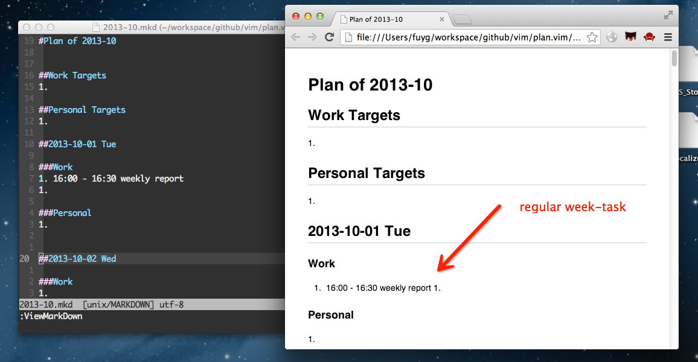

plan.vim
=========
A vim utility for making monthly plan, todo and so on in markdown.

##Install
1. Copy the `plugin` folder to `~/.vim`.
1. Configure regular-task options in `.vimrc`.
1. Use `:PlanMonth`/`:DiaryMonth` command to generate plan/diary template for a month.

Tips: If you want to preview markdown file, you can install
[MarkdownViewer.vim](https://github.com/FuDesign2008/MarkdownViewer.vim).

##Usage

###Create Plan/Diary Template
1. `:PlanMonth [month]  [year]` insert the template of plan for a month.
    * If there is no arguments, the command will insert the template for
    current month.
    * If there is only `month` argument, the command will insert template for
    the month in current year.
    * If there are both `month` and `year` arguments, the command will insert
    template for the month in the year.
1. `:PlanDay [day] [month] [year]` insert the template of plan for a day.
    * If there is no arguments, the command will insert the template for today.
    * If there is only `day` argument, the command will insert template for the
    day in current month and current year.
    * If there are both `day` and `month` arguments, the command will insert
    template for the day in the month and current year.
    * If there are `day`, `month`, `year` arguments, the command will insert
    template for the day in the month and the year.
1. `:DiaryMonth [month]  [year]` insert the template of diary for a month.
    * See `:PlanMonth`
1. `:DiaryDay [day] [month] [year]` insert the template of diary for a day.
    * See `:PlanDay`
1. `:GotoToday` goto the line of today in planning/diary file, the default map
   key is `<leader>gt`.

###Open Plan/Diary File
1. `:EditPlan` open and edit planning file and goto the line of today.
1. `:EditDiary` open and edit diary file and goto the line of today.

##Options
1. `g:p_plan_file` the path of planning file, you can configure this option in
`.vimrc`.
1. `g:p_diary_file` the path of planning file, you can configure this option in
`.vimrc`.
1. `g:p_change_dir` Change to directory or not when executing `:EditPlan` and
   `:EditDiary` commands. The default value is `0`.
1. `g:plan_custom_keymap` custom to make key mapping or not, default value is

###Regular Plan Task
1. `g:plan_month_work` regular work-task for every month.
1. `g:plan_month_personal` regular personal-task for every month.
1. `g:plan_week_work` regular work-task for every week.
1. `g:plan_week_personal` regular personal-task for every week.

Take my regular tasks configuration for example:

```vim
"
" NOTE: add `;` to the end of each task
"
let g:plan_week_work = {
    \ 1 : '1. 10:00 - 11:00 @2层灵芝 YNote Editor Weekly meeting;',
    \ 2 : '1. 16:00 - 16:30 weekly report;',
    \ 5 : '1. 14:00 - 16:00 @二层甘草 webfront weekly meeting;'
    \}
let g:plan_week_personal = {
    \}
let g:plan_month_work = {
    \ 18: '1. Sprint 总结, 会议;'
    \}
let g:plan_month_personal = {
    \ 3 : '1. 18:00 ~ @ buy <<Programmer>> magazine;',
    \ 8 : '1. 还房贷;',
    \ 28 : '1. 月度总结;1. 下月计划;'
    \}

```

##Screenshot


##Update

###2015-01-20
* REMOVE
    - `:EditPlanDir` command
    - default mapping keys for `:EditPlanDir` and `:EditPlan` commands
* ADD
    - `:EditDiary` command
    - `g:p_diary_file`, `g:p_change_dir`
* RENAME
    - `g:plan_file` rename to `g:p_plan_file`


###2015-01-05
* REMOVE
    - the modules that depend on `node.js`

###2014-12-03
* ADD
    - `:DiaryMonth`, `:DiaryDay` commands
